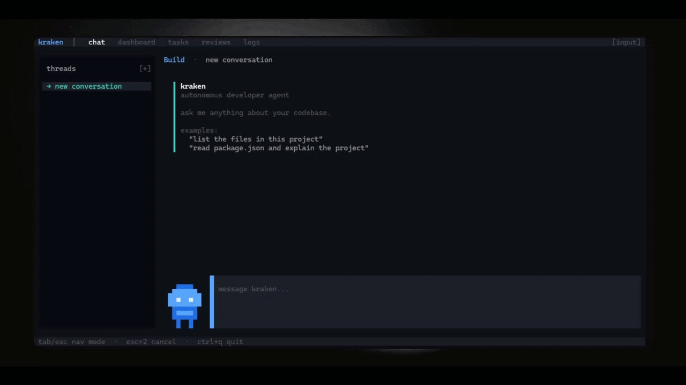

<p align="center">
  
</p>

<h1 align="center">Kraken</h1>

<p align="center">
  <strong>An autonomous developer agent that lives in your terminal.</strong>
</p>

<p align="center">
  Kraken understands your codebase, runs tasks on a schedule, watches your files for changes, receives webhooks — and acts on all of it autonomously. Think of it as a developer that never sleeps.
</p>

---

## Motivation

Kraken was born from a simple observation: tools like [Claude Code](https://github.com/anthropics/claude-code), [OpenCode](https://github.com/anomalyco/opencode), and [OpenClaw](https://github.com/openclaw/openclaw) have demonstrated that LLM-powered agents can become genuine companions for software developers — not just chat interfaces that answer questions, but systems capable of navigating codebases, executing multi-step plans, and operating with meaningful autonomy. These projects proved that the gap between "AI assistant" and "AI collaborator" is smaller than it seems, and that the terminal is the right environment to close it.

However, most existing tools focus on a single interaction model: the developer asks, the agent responds. Kraken takes this further by introducing persistent autonomy. Rather than waiting for human input, Kraken can monitor file changes, respond to webhooks, execute scheduled tasks, and delegate work to sub-agents — all while maintaining a rich terminal interface for real-time collaboration. The goal is not to replace the developer but to act as a tireless companion that handles the repetitive, the mechanical, and the tedious, freeing the developer to focus on design, architecture, and the problems that actually require human judgment.

This project is also an exercise in polyglot systems design. By combining Rust (for low-latency scheduling and OS-level file watching), Go (for high-throughput HTTP proxying and webhook handling), and TypeScript (for the agent brain, plugin system, and terminal UI), Kraken explores how each language's strengths can be composed into a cohesive whole through protobuf-defined contracts and local RPC.

<p align="center">
  
</p>

---

## What is Kraken?

Kraken is an AI-powered autonomous agent built on a **three-process architecture**: a Rust scheduler, a Go gateway, and a TypeScript TUI, all orchestrated from a single CLI command. Unlike traditional coding assistants that operate in a request-response loop, Kraken is designed to run continuously — monitoring your project, reacting to external events, and executing tasks on your behalf without requiring constant supervision.

At its core, Kraken treats the development environment as an event-driven system. File changes, cron triggers, and incoming webhooks are all normalized into a unified event stream that feeds into the agent's execution loop. The agent then decides how to respond: running tests after a source file changes, reviewing a pull request when a GitHub webhook arrives, or executing a scheduled code quality scan. Each of these behaviors is configurable through a declarative YAML file, and the agent's capabilities can be extended at runtime through a plugin system.

The terminal interface is built with OpenTUI, a React-based framework for terminal applications. This provides a rich, interactive experience — syntax-highlighted diffs, real-time streaming of LLM responses, and a conversational interface — while keeping everything inside the terminal where developers already work.

<p align="center">
  
</p>

---

## Architecture

Kraken's architecture is intentionally distributed across three cooperating processes, each written in the language best suited for its responsibilities. The processes communicate over ConnectRPC on localhost, using protobuf-defined contracts as the single source of truth for all cross-language interfaces.

The **Scheduler** is written in Rust and handles two performance-sensitive tasks: cron-based job scheduling and OS-level file system watching. Rust was chosen here because both operations require low-latency event processing and direct interaction with operating system APIs. The scheduler uses `tokio` for async execution and `notify` for cross-platform file watching, streaming events to the TUI process via gRPC.

The **Gateway** is written in Go and serves as the LLM proxy and webhook ingestion point. It normalizes requests across multiple LLM providers (OpenRouter, Anthropic, OpenAI), handles streaming responses, and validates incoming webhook signatures from GitHub and GitLab. Go's strengths in HTTP handling, concurrency, and deployment simplicity make it a natural fit for this role.

The **TUI** is written in TypeScript and contains the agent brain — the execution loop, tool registry, conversation history, persistent memory, plugin system, and SQLite storage layer. It renders a terminal interface using OpenTUI and orchestrates all interactions between the user, the LLM, and the supporting services.

| Service       | Language   | Port  | Role                                                 |
| ------------- | ---------- | ----- | ---------------------------------------------------- |
| **Scheduler** | Rust       | 50051 | Cron engine + file watchers, streams events via gRPC |
| **Gateway**   | Go         | 50052 | LLM proxy (multi-provider) + webhook receiver        |
| **TUI**       | TypeScript | —     | Terminal UI, agent brain, tools, storage             |

```
┌─────────────────────────────────────────────────┐
│                     CLI                         │
│              (spawns & orchestrates)             │
├────────────────┬────────────────┬───────────────┤
│   Scheduler    │    Gateway     │     TUI       │
│    (Rust)      │     (Go)      │ (TypeScript)   │
│                │               │               │
│  • Cron jobs   │  • LLM proxy  │  • Agent loop │
│  • Watchers    │  • Webhooks   │  • Tools      │
│  • Events      │  • Streaming  │  • Storage    │
│                │               │  • Plugins    │
└────────┬───────┴───────┬───────┴───────┬───────┘
         │    ConnectRPC (localhost)      │
         └───────────────────────────────┘
```

---

## Installation

### Quick install (macOS / Linux)

```bash
curl -fsSL https://raw.githubusercontent.com/galfrevn/kraken/main/scripts/install.sh | bash
```

This will detect your platform, download pre-built binaries (if a release exists), or clone and build from source. It also installs Bun if it's missing and adds `kraken` to your PATH.

### Quick install (Windows — PowerShell)

```powershell
irm https://raw.githubusercontent.com/galfrevn/kraken/main/scripts/install.ps1 | iex
```

Same behavior as the bash installer: downloads pre-built binaries if available, otherwise clones and builds from source. Installs Bun if missing and adds `kraken` to your PATH.

### From source (all platforms)

If you prefer to build everything yourself:

#### Prerequisites

- [Bun](https://bun.sh) 1.3.10+
- [Go](https://go.dev) 1.26+
- [Rust](https://rustup.rs) (stable, edition 2024)
- [Buf CLI](https://buf.build/docs/installation) for protobuf generation
- [protoc](https://grpc.io/docs/protoc-installation/) for proto compilation

#### macOS / Linux

```bash
git clone https://github.com/galfrevn/kraken.git
cd kraken
bash scripts/setup/bash.sh
```

#### Windows

```powershell
git clone https://github.com/galfrevn/kraken.git
cd kraken
powershell -ExecutionPolicy Bypass -File scripts/setup/powershell.ps1
```

#### Manual setup

For more control over the build process:

```bash
bun install             # Install dependencies
bun run generate        # Generate protobuf code
bun run build           # Build all services
bun run dev             # Start in dev mode
```

### Verify installation

```bash
kraken version          # Print version
kraken doctor           # Check system health
kraken init             # Initialize in a project
```

---

## Configuration

Kraken uses a layered configuration system that merges values from multiple sources. Environment variables defined in `~/.kraken/.env` are loaded first, followed by the main configuration file at `~/.kraken/kraken.yml`, and finally any runtime environment variable overrides. This design allows sensitive values like API keys to be stored outside the repository while keeping project-specific settings in a version-controlled YAML file.

To get started, set your LLM provider key:

```bash
# Any of these work — Kraken auto-detects the provider
export ANTHROPIC_API_KEY="sk-..."
export OPENAI_API_KEY="sk-..."
export KRAKEN_OPENROUTER_API_KEY="sk-..."
```

---

## Scheduling & automation

One of Kraken's distinguishing features is its ability to operate without direct human interaction. Through the scheduler service, developers can define recurring jobs and file watchers that trigger autonomous agent actions. This transforms Kraken from a reactive assistant into a proactive development companion.

### Cron jobs

Recurring tasks are defined declaratively in `kraken.yml` using standard cron expressions. Each job specifies a task template that the agent executes when the schedule fires. The scheduler validates expressions at registration time and tracks the next execution timestamp, ensuring that jobs fire exactly once per scheduled interval even under system load.

```yaml
scheduler:
  crons:
    - name: review-prs
      expression: "0 9 * * *"
      task: review-open-prs
      enabled: true

    - name: run-tests
      expression: "*/30 * * * *"
      task: run-test-suite
      enabled: true
```

### File watchers

File watchers monitor directories for changes and trigger agent actions with configurable debounce intervals and ignore patterns. The watcher engine uses OS-native file system notifications (via Rust's `notify` crate) for low-latency detection, and each watcher operates independently — registering multiple watchers no longer overwrites previous ones, as each is stored and managed by its unique identifier.

```yaml
scheduler:
  watchers:
    - name: src-watcher
      paths: ["./src", "./lib"]
      ignore: ["node_modules", ".git", "dist"]
      debounce_ms: 500
```

### Webhooks

Kraken can receive and process webhooks from external services such as GitHub and GitLab. Each webhook registration includes a provider identifier and an optional secret for signature validation. GitHub webhooks are verified using HMAC-SHA256, and GitLab webhooks use constant-time token comparison, ensuring that only authenticated payloads are processed.

```yaml
webhooks:
  - name: github-push
    provider: github
    secret: "whsec_..."
    events: ["push", "pull_request"]
```

---

## Plugin system

Kraken's functionality is designed to be extended at runtime through a plugin system. Plugins can register new tools that the agent can invoke, hook into lifecycle events such as tool calls and conversation boundaries, extend the system prompt with domain-specific instructions, and declare configuration schemas that are validated on load.

The plugin API is intentionally minimal. A plugin is a JavaScript or TypeScript module that exports a `KrakenPlugin` object, typically constructed with the `definePlugin` helper from the SDK. Plugins are loaded dynamically via `await import()` and can be installed from the built-in plugin store, a local path, or a remote URL.

```typescript
import { definePlugin } from "@kraken/sdk";

export default definePlugin({
  name: "my-plugin",
  version: "1.0.0",

  tools: [
    {
      name: "my_tool",
      description: "Does something useful",
      parameters: [{ name: "input", type: "string", required: true }],
      async execute(params) {
        return { success: true, output: `Processed: ${params.input}` };
      },
    },
  ],

  hooks: {
    beforeToolCall(toolName, params) {
      /* ... */
    },
    afterToolCall(toolName, result) {
      /* ... */
    },
    onConversationStart(context) {
      /* ... */
    },
  },
});
```

---

## Built-in tools

Kraken ships with over 30 built-in tools that the agent can invoke autonomously during task execution. These tools cover the most common operations a developer performs: reading and writing files, navigating codebases, running shell commands, interacting with git, searching the web, and managing scheduled work. Each tool includes input validation, cross-platform support (Windows, macOS, and Linux), and security checks where appropriate.

| Category       | Tools                                                                                                              |
| -------------- | ------------------------------------------------------------------------------------------------------------------ |
| **Files**      | `read_file`, `write_file`, `edit_file`, `delete_file`, `move_file`, `list_directory`, `glob_files`, `search_files` |
| **Git**        | `git_status`, `git_diff`, `git_commit`, `git_log`                                                                  |
| **Code**       | `code_outline`, `diff_files`, `replace_in_files`, `read_lines`                                                     |
| **Web**        | `web_search`, `fetch_url`, `http_request`                                                                          |
| **Scheduling** | `schedule_cron`, `list_schedules`, `delete_schedule`, `schedule_watcher`, `list_watchers`, `delete_watcher`        |
| **Memory**     | `remember`, `recall`, `index_project`                                                                              |
| **Tasks**      | `task_list`, `task_submit`, `schedule_once`, `list_timers`, `cancel_timer`                                         |
| **System**     | `run_command`, `environment`, `view_image`, `count_tokens`                                                         |
| **Model**      | `model_list`, `model_switch`, `current_model`, `delegate`                                                          |

---

## Development

The project uses Turborepo to orchestrate builds, typechecks, and linting across all workspaces. Individual services can also be built and tested independently using their native toolchains.

```bash
# Run all services in dev mode
bun run dev

# Type-check everything
bun run typecheck

# Lint
bun run lint

# Format
bun run format

# Run tests (core)
cd apps/core && bun test

# Build scheduler only
cd apps/scheduler && cargo build --release

# Build gateway only
cd apps/gateway && go build -o ./bin/gateway ./cmd/gateway
```

---

## Project structure

The repository is organized as a monorepo with five applications, three shared packages, and a protobuf directory that serves as the canonical API contract between all services.

```
apps/
  cli/            TypeScript — CLI entry point, process orchestration
  core/           TypeScript — Agent brain: execution loop, tools, storage, plugins
  gateway/        Go — LLM proxy + webhook receiver (ConnectRPC)
  scheduler/      Rust — Cron engine + file watcher (gRPC/tonic)
  tui/            TypeScript/React — Terminal UI (OpenTUI)
packages/
  sdk/            Plugin authoring API
  plugins/        Official plugin registry
  configuration/  Shared TypeScript config
proto/agent/v1/   Protobuf definitions (single source of truth)
gen/
  ts/             Generated TypeScript (protobuf-es)
  go/             Generated Go (protoc-gen-go + connect-go)
```

---

## Tech stack

Kraken deliberately combines multiple language ecosystems, selecting each for the specific strengths it brings to the system. TypeScript provides the flexibility and ecosystem needed for the agent brain, plugin system, and terminal UI. Go offers the concurrency model and HTTP primitives required for a high-throughput LLM proxy. Rust delivers the performance guarantees necessary for real-time scheduling and file system monitoring. Protobuf and ConnectRPC bind them together with type-safe, language-agnostic contracts.

| Layer         | Technology                                  |
| ------------- | ------------------------------------------- |
| Monorepo      | Turborepo + Bun                             |
| TypeScript    | ESNext, strict mode, `verbatimModuleSyntax` |
| TUI framework | OpenTUI (`@opentui/react`)                  |
| Gateway       | Go 1.26                                     |
| Scheduler     | Rust (edition 2024), tokio async            |
| RPC           | ConnectRPC, protobuf                        |
| Database      | SQLite via `bun:sqlite` (WAL mode)          |
| Linting       | oxlint                                      |
| Formatting    | oxfmt                                       |

---

## License

MIT
