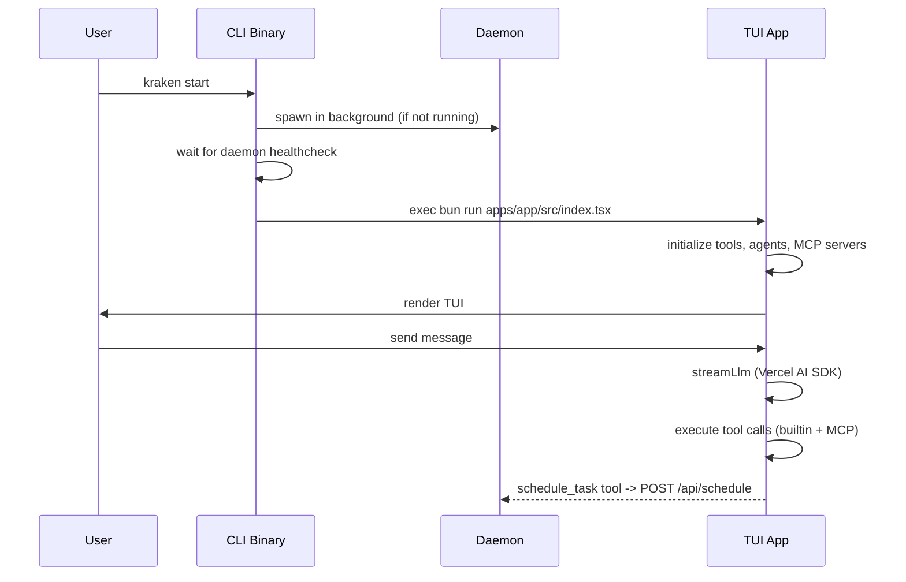
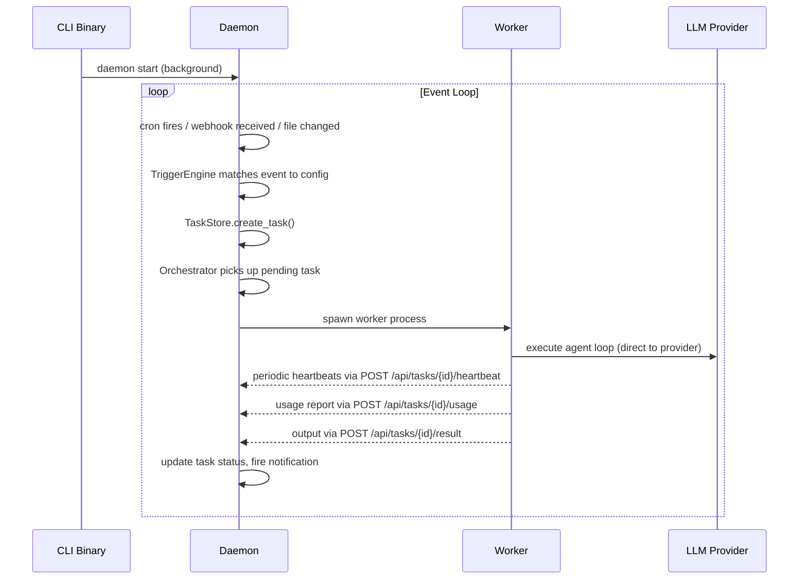
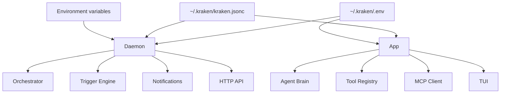

# Architecture

## Overview

Kraken is a two-process system: a Rust daemon and a TypeScript app. The daemon runs in the background and handles orchestration, scheduling, and event processing. The app runs in the foreground when the user wants to interact with the agent via the terminal.

```
┌──────────────────────────────────────────────────────┐
│                      CLI (Rust)                      │
│              kraken start / kraken daemon             │
├──────────────────────┬───────────────────────────────┤
│     Daemon (Rust)    │         App (TypeScript)      │
│     Port 50051       │         Port 7899             │
│                      │                               │
│  • Orchestrator      │  • Agent brain (LLM loop)     │
│  • Cron engine       │  • Tool registry              │
│  • File watchers     │  • Session management         │
│  • Webhook server    │  • TUI (OpenTUI/React)        │
│  • Trigger engine    │  • MCP client                 │
│  • Task store        │  • Storage (SQLite/Drizzle)   │
│  • Notifications     │  • Model registry             │
│  • HTTP API          │  • Skill system               │
└──────────┬───────────┴───────────────┬───────────────┘
           │    HTTP REST (localhost)   │
           └───────────────────────────┘
```

| Component | Language | Port | Role |
| --- | --- | --- | --- |
| **Daemon** | Rust | 50051 | Orchestration, scheduling, triggers, notifications, HTTP API |
| **App** | TypeScript/React | 7899 | TUI, agent brain, tools, sessions, MCP, storage |

## Process Lifecycle

### Interactive Mode (`kraken start`)



### Daemon-Only Mode (`kraken daemon start`)



## Component Details

### Daemon (Rust)

The daemon is a single Rust binary (`apps/daemon/`) built with tokio for async execution. It manages:

**Orchestrator** -- Polls the task store every 1 second for pending tasks, spawns worker processes up to a configurable concurrency limit, monitors heartbeats, handles retries, and manages git worktrees for task isolation.

**Trigger Engine** -- Matches incoming events (cron ticks, webhook payloads, file changes, slash commands) against configured triggers in `kraken.jsonc`. When a trigger fires, it creates a task using the trigger's task template with `{{event.xxx}}` variable substitution.

**Cron Engine** -- Registers cron expressions from config, ticks on schedule, and emits events to the trigger engine via a tokio broadcast channel.

**File Watcher Engine** -- Uses the `notify` crate for OS-native file system notifications. Each watcher operates independently with configurable debounce intervals and ignore patterns.

**Webhook Server** -- Runs on a separate port (default 50052, binds to `127.0.0.1` by default, configurable via `KRAKEN_WEBHOOK_BIND`). Validates GitHub webhooks via HMAC-SHA256 and GitLab webhooks via constant-time token comparison.

**HTTP API** -- Axum-based REST API on port 50051. Exposes task management, health checks, status, stats, config, secrets, heartbeat, and shutdown endpoints.

**Notification Dispatcher** -- Fan-out system that routes task lifecycle events to configured notification channels (Slack, Discord, Email via Resend, GitHub, System notifications).

**Task Store** -- SQLite database (via rusqlite) storing tasks, logs, and statistics. Supports status transitions, retry tracking, and cost aggregation.

### App (TypeScript)

The app is a Bun-based TypeScript application (`apps/app/`) with a React-based terminal UI:

**Agent Brain** -- Uses the Vercel AI SDK (`ai` package) with `streamText` to drive the LLM conversation loop. Supports multiple providers (OpenRouter, Anthropic, OpenAI) configured via `~/.kraken/kraken.jsonc`.

**Tool Registry** -- Tools are defined with `defineTool()` using Zod schemas for parameter validation. Each tool receives a `ToolContext` with session ID, message ID, working directory, and abort signal. 8 built-in tools: bash, read, write, edit, glob, grep, schedule_task, skill.

**MCP Client** -- Connects to MCP servers configured in `kraken.jsonc` under the `mcp` key. Supports local (stdio) and remote (StreamableHTTP, SSE) transports. MCP tools are merged with builtin tools for the LLM.

**Session Management** -- Sessions and messages are persisted in SQLite via Drizzle ORM. An event bus (`bus/`) publishes lifecycle events for reactive UI updates.

**TUI** -- Built with OpenTUI (`@opentui/react`), a React-based framework for terminal applications. Renders at 60 FPS with syntax highlighting, streaming LLM responses, and keyboard shortcuts.

**Agents** -- Two built-in agents: `build` (full access to all tools) and `plan` (read-only, restricted to read/glob/grep/bash). The `toolFilter` is enforced both in the tools passed to the LLM and in the system prompt.

**Skill System** -- Discovers `SKILL.md` files in `~/.kraken/skills`, `./.kraken/skills`, and `packages/skills`. Skills provide specialized instructions that the agent can load on demand via the `skill` tool.

## Communication

The daemon and app communicate over HTTP REST on localhost. The primary integration point is the `schedule_task` tool in the app, which calls `POST /api/schedule` on the daemon to create background tasks.

The app also starts its own Hono-based HTTP server (port 7899) for internal routes: health checks, SSE events, session CRUD, and model metadata.

## Storage

| Store | Technology | Location | Used By |
| --- | --- | --- | --- |
| Task database | SQLite (rusqlite) | Configured via `databasePath` in `kraken.jsonc` | Daemon |
| Session database | SQLite (bun:sqlite + Drizzle) | `~/.kraken/data/kraken.db` | App |
| Configuration | JSONC | `~/.kraken/kraken.jsonc` | Both |
| API keys | dotenv | `~/.kraken/.env` | Both |
| PID file | Plain text | `~/.kraken/daemon.pid` | Daemon |
| Model state | JSON | `~/.kraken/cache/modelstate.json` | App |

## Worker Model

Workers are headless instances of the agent that run without the TUI. The orchestrator spawns them as child processes:

```
bun run apps/app/src/worker.ts --task-id=<uuid> --daemon-url=http://localhost:50051
```

The worker entry point (`worker.ts`) initializes tools and agents, fetches the task from the daemon API (using both `name` and `description` as the prompt), runs the LLM agent loop, and exits. It does not load OpenTUI, React, or the HTTP server -- only the agent brain and tool registry.

Each worker gets its own git worktree for isolation. On success, the worktree is cleaned up. On failure, it is preserved for debugging.

Workers send periodic heartbeats (every 30s) to `POST /api/tasks/{id}/heartbeat` so the daemon knows they are alive. Workers that stop heartbeating are killed after the configured `heartbeatTimeoutSeconds` (default 300s). On completion, workers report token usage and output back to the daemon.

Workers exit with code 0 on success and code 1 on stream errors or abort, so the daemon can correctly classify task outcomes.

## LLM Integration

Both the interactive TUI and autonomous workers talk directly to LLM providers via the Vercel AI SDK. This gives the lowest latency for real-time conversations and simplifies the worker architecture.

Supported providers: OpenRouter, Anthropic, OpenAI.

## Context Window Management

Long conversations are automatically managed to avoid exceeding model context limits:

1. **Token estimation** -- Approximate token counting (4 chars ≈ 1 token) tracks conversation size.
2. **Tool result truncation** -- Large tool results (e.g., reading a 5000-line file) are truncated to ~4000 tokens, keeping the start and end with a truncation marker.
3. **Extractive summarization** -- When the conversation exceeds 75% of the model's context window, older messages (excluding the first user message and the 10 most recent messages) are condensed into an extractive summary that preserves: files read, files modified, commands run, and the last assistant reasoning.

This is implemented in `apps/app/src/session/context.ts` and integrated into the message processor.

## File References (`@` mentions)

The TUI supports `@` file references for injecting file contents into the LLM context:

1. Typing `@` at a word boundary opens a fuzzy file autocomplete dropdown.
2. The file index is served by `GET /find/files?query=...` with a 30-second cache and 100ms client-side debounce.
3. On message submission, `@path` tokens are parsed and resolved: file contents are read and prepended to the user prompt as `<file path="...">...</file>` blocks.

## Directory Structure

```
apps/
  app/                TypeScript/React -- TUI + agent brain + headless worker
    src/
      agent/          Agent definitions and system prompt
      bus/            Event bus for reactive updates
      config/         Configuration loading
      mcp/            MCP client (stdio, HTTP, SSE transports)
      models/         LLM model registry and metadata
      provider/       LLM provider integration
      server/         Internal HTTP server (Hono)
      session/        Session management, LLM streaming, context window
      skill/          Skill discovery and loading
      storage/        SQLite schema and database
      tool/           Tool definitions (bash, read, write, edit, glob, grep, schedule, skill)
      tui/            Terminal UI components (OpenTUI/React)
  daemon/             Rust -- Full daemon
    src/
      cli/            CLI commands (clap)
      cron.rs         Cron scheduling engine
      daemon/         DaemonState, config, reload
      db/             SQLite task store
      http_api.rs     Axum REST API
      main.rs         Entry point + run_daemon()
      notifications/  Notification channels and dispatcher
      orchestrator/   Task orchestration, workers, worktrees, heartbeat
      triggers/       Trigger engine, webhook, cron, watcher listeners
      watcher.rs      File system watcher engine
packages/
  configuration/      Shared TypeScript configuration (tsconfig)
  skills/             Official skill definitions (SKILL.md files)
scripts/
  install.sh          End-user installer (macOS/Linux)
```

## Configuration Flow



Configuration loads in layers:
1. `~/.kraken/.env` -- API keys and secrets
2. `~/.kraken/kraken.jsonc` -- Configuration (triggers, notifications, orchestrator, LLM provider/model, MCP servers)
3. Environment variable overrides
