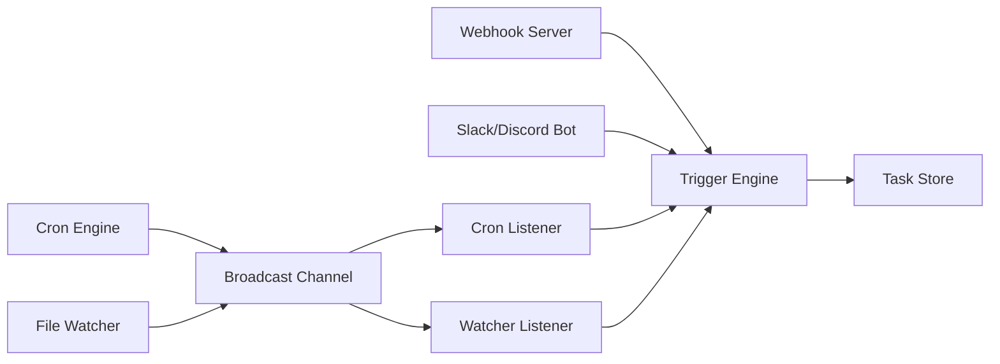
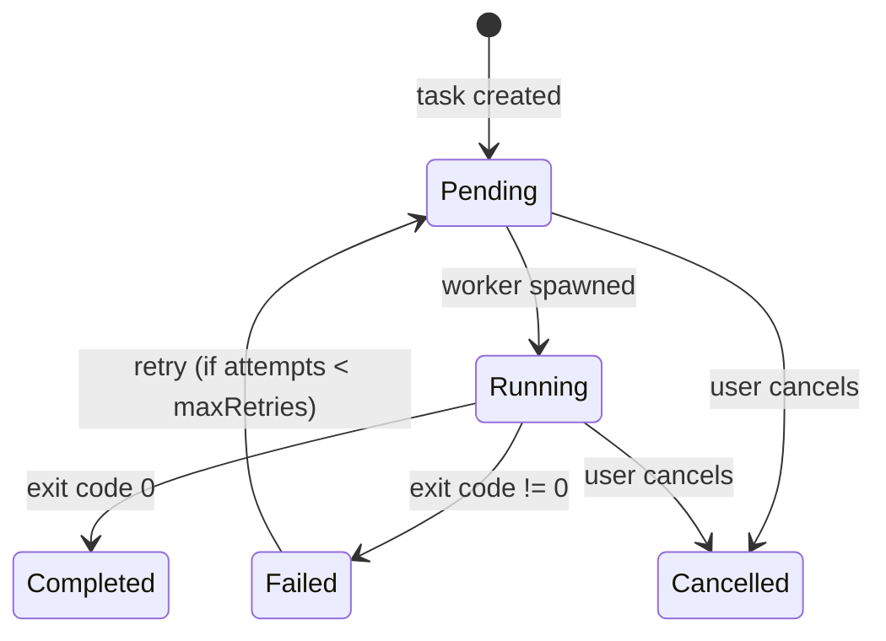

# Daemon

The Kraken daemon is a Rust binary that runs in the background. It handles task orchestration, event-driven triggers, notifications, and exposes an HTTP API for task management.

## CLI Reference

### `kraken` / `kraken start`

Start the interactive TUI with the daemon.

```bash
kraken                      # Start TUI + daemon (default)
kraken start                # Same as above
kraken start --no-daemon    # Start TUI only, skip daemon
kraken start --dev          # Development mode with hot reload
```

### `kraken daemon`

Control the background daemon directly.

```bash
kraken daemon start                  # Start daemon in background
kraken daemon start --port 8080      # Start on custom port
kraken daemon start --config ./my.jsonc # Use custom config file
kraken daemon run                    # Run in foreground (for Docker, systemd)
kraken daemon run --log-file /var/log/kraken.log
kraken daemon stop                   # Graceful shutdown
kraken daemon stop --force           # Kill after 5s grace period
kraken daemon status                 # Show status, uptime, workers, tasks
```

### `kraken init`

Interactive setup wizard. Configures LLM provider, API key, triggers, and notifications. Generates `kraken.jsonc`.

```bash
kraken init              # Interactive wizard
kraken init --defaults   # Skip prompts, create minimal config
```

### `kraken config`

Manage configuration.

```bash
kraken config show       # Print config (secrets redacted)
kraken config path       # Print resolved config file path
kraken config get orchestrator.maxConcurrentTasks
kraken config set orchestrator.maxConcurrentTasks 5
kraken config validate   # Validate kraken.jsonc syntax
```

### `kraken task`

Manage tasks.

```bash
kraken task create "Run the test suite" --priority 8 --agent build --workdir /path/to/repo
kraken task list --status running --limit 10
kraken task show <task-id>         # Full UUID or 6+ char prefix
kraken task cancel <task-id>
kraken task retry <task-id> --agent build
kraken task logs <task-id> --follow
```

### `kraken trigger`

```bash
kraken trigger list       # List configured triggers from kraken.jsonc
kraken trigger test <name>  # Fire a trigger manually
```

### `kraken notification`

```bash
kraken notification list
kraken notification test <channel-name> --message "Hello from Kraken"
```

### `kraken stats`

```bash
kraken stats                  # Today's stats
kraken stats --period week    # Last 7 days
kraken stats --period month   # Last 30 days
```

Shows: completed/failed task counts, pending/running tasks, token usage, estimated cost.

### `kraken logs`

```bash
kraken logs                # Last 50 lines
kraken logs --lines 100    # Last 100 lines
kraken logs --follow       # Stream in real-time
```

### `kraken mcp`

```bash
kraken mcp list                    # List configured MCP servers
kraken mcp add myserver --command "npx -y @modelcontextprotocol/server-sqlite db.sqlite"
kraken mcp add remote --url https://mcp.example.com
kraken mcp remove myserver
kraken mcp enable myserver
kraken mcp disable myserver
```

### `kraken clean`

```bash
kraken clean --tasks 30           # Remove tasks older than 30 days
kraken clean --tasks 30 --dry-run # Preview without deleting
```

### `kraken uninstall`

```bash
kraken uninstall                # Remove everything
kraken uninstall --keep-global  # Only remove project files, keep ~/.kraken
kraken uninstall --yes          # Skip confirmation
```

### Global Flags

| Flag | Description |
| --- | --- |
| `--json` | Force JSON output (for scripting) |
| `--verbose` | Enable verbose logging to stderr |

---

## Trigger System

The trigger engine matches incoming events against configurations in `kraken.jsonc` and creates tasks when conditions are met.



### Trigger Types

| Type | Source | Config Key |
| --- | --- | --- |
| Cron | Scheduled interval | `triggers.crons` |
| Webhook | HTTP POST from GitHub/GitLab | `triggers.webhooks` |
| File watcher | OS file system events | `triggers.watchers` |
| CI failure | GitHub check_suite (sugar) | `triggers.ci_failures` |
| PR mention | GitHub PR comment (sugar) | `triggers.pr_mentions` |
| Slash command | Slack/Discord message | `triggers.slash_commands` |

### Template Variables

Task templates support `{{event.xxx}}` syntax for variable substitution from the event payload:

```jsonc
"task": "Review PR #{{event.pull_request.number}}: {{event.pull_request.title}}"
```

Dot notation navigates nested JSON fields. Values are truncated at 500 characters. Missing fields resolve to empty strings.

### Webhook Filter Expressions

Filters use the syntax: `<field> <operator> '<value>'`

```jsonc
"filter": [
  "action equals 'opened'",
  "pull_request.head.ref starts_with 'feature/'",
  "body contains '@kraken'"
]
```

**Operators**: `equals`, `not_equals`, `contains`, `not_contains`, `starts_with`, `ends_with`, `matches` (regex).

---

## Orchestrator

The orchestrator is the core scheduling loop that picks up pending tasks and spawns workers.

### Task Lifecycle



### Worker Spawning

1. Orchestrator polls `TaskStore` every 1 second for pending tasks
2. If a slot is available (active workers < `maxConcurrentTasks`), it picks the highest-priority task
3. Creates a git worktree for task isolation: `.kraken-worktrees/kraken-task-<id-prefix>`
4. Spawns a worker process with the task ID and daemon URL
5. Workers send periodic heartbeats (every 30s) to `POST /api/tasks/{id}/heartbeat`
6. Workers that stop heartbeating are killed after `heartbeatTimeoutSeconds`
7. On completion, workers report output via `POST /api/tasks/{id}/result` and usage via `POST /api/tasks/{id}/usage`
8. Workers exit with code 0 on success, 1 on errors -- daemon maps exit code to task status

### Retry Logic

- Tasks with exit code 1 (error) or 10 (heartbeat timeout) are eligible for retry
- Retry count increments; task returns to `pending` after `backoffSeconds` delay
- Stops after `maxRetries` attempts

### Worktree Management

Each task runs in its own git worktree branched from the repository's HEAD:

- Branch name: `<branchPrefix><sanitized-task-name>-<task-id-prefix>`
- On success: worktree is removed
- On failure: worktree is preserved for debugging

---

## HTTP API

Base URL: `http://localhost:50051`

### Health & Status

| Method | Path | Description |
| --- | --- | --- |
| `GET` | `/api/health` | Health check (`{"status": "ok"}`) |
| `GET` | `/api/status` | Daemon status (pid, uptime, workers, task counts) |
| `POST` | `/api/shutdown` | Trigger graceful shutdown |

### Tasks

| Method | Path | Description |
| --- | --- | --- |
| `POST` | `/api/schedule` | Create a task (queued for immediate execution) |
| `GET` | `/api/tasks` | List tasks (query: `status`, `limit`, `offset`, max 500) |
| `GET` | `/api/tasks/{id}` | Get task details (supports ID prefix) |
| `POST` | `/api/tasks/{id}/cancel` | Cancel a task |
| `POST` | `/api/tasks/{id}/retry` | Retry a failed/cancelled task (optional `agent` override) |
| `GET` | `/api/tasks/{id}/logs` | Get task log entries |
| `POST` | `/api/tasks/{id}/heartbeat` | Record worker heartbeat |
| `POST` | `/api/tasks/{id}/usage` | Report token usage (`prompt_tokens`, `completion_tokens`, `cost_usd`) |
| `POST` | `/api/tasks/{id}/result` | Save worker output (`output`) |

### Config & Secrets

| Method | Path | Description |
| --- | --- | --- |
| `GET` | `/api/config` | Get current config (secrets redacted) |
| `GET` | `/api/secrets` | List secret key names |
| `POST` | `/api/secrets` | Set a secret (`key`, `value`) |
| `DELETE` | `/api/secrets/{key}` | Delete a secret |

### Stats & Maintenance

| Method | Path | Description |
| --- | --- | --- |
| `GET` | `/api/stats` | Usage statistics (query: `period=today\|week\|month`) |
| `POST` | `/api/clean` | Clean old tasks |

### Schedule Task Request

```json
POST /api/schedule
{
  "prompt": "Run the test suite and fix failures",
  "priority": 5,
  "agent": "build",
  "workdir": "/home/deploy/myproject"
}
```

Response:

```json
{
  "task_id": "a1b2c3d4-...",
  "status": "scheduled"
}
```

---

## Notification Channels

### Slack

Posts messages to a Slack channel via incoming webhook. Formats task details as Slack block kit.

**Required config**: `webhookUrl`

### Discord

Posts messages to a Discord channel via webhook. Similar formatting to Slack.

**Required config**: `webhookUrl`

### Email (Resend)

Sends email notifications via the Resend API.

**Required config**: `apiKey`, `from`, `to`

### GitHub

Posts comments on GitHub issues/PRs.

**Required config**: `token`, `repo`

### System

Sends OS-native desktop notifications (macOS Notification Center, Linux notify-send).

**Required config**: none

### Notification Events

| Event | When |
| --- | --- |
| `TaskStarted` | Worker process spawned |
| `TaskCompleted` | Task finished with exit code 0 |
| `TaskFailed` | Task finished with non-zero exit code (after all retries) |
| `PullRequestCreated` | Worker created a PR (detected from task artifacts) |
| `TriggerFired` | A trigger matched an event and created a task |
| `DailyDigest` | Sent every 24 hours with task summary |
| `CostWarningExceeded` | Daily LLM spend exceeded threshold (sent once per day) |

### Hot Reload

On Unix systems, sending `SIGHUP` to the daemon process reloads configuration from disk without restarting:

```bash
kill -HUP $(cat ~/.kraken/daemon.pid)
```

This reloads triggers, notifications, cron schedules, and file watchers.
